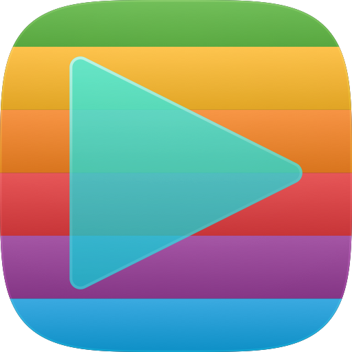

# IconBuilder

A small native macOS (SwiftUI) app that reads Apple **Icon Composer `.icon`**
bundles, draws the icon from its `icon.json` definition, lets you apply
**iOS 26 / iOS 27** rendering recipes, and exports **vector PDF in CMYK** for print.



## What it does

- **Parses `.icon` bundles** — the `icon.json` manifest (groups, layers,
  positions, fills, opacity, blend modes) with full **appearance
  specialization** resolution (`light` / `dark` / `tinted` / `clear`).
- **Renders faithfully** — each asset SVG is parsed to a `CGPath` (the app has
  its own dependency-free SVG-shape + path parser) and composited with the
  manifest's coordinate math, `automatic-gradient` fills, shadows and glass.
  The same render code drives both the on-screen preview and every export, so
  it is WYSIWYG.
- **Recipes (OS masking + effects)** — `iOS 26`, `iOS 27` and `watchOS`
  presets control the mask shape and effects. The default **Apple (measured)**
  mask is Apple's exact icon contour, extracted from a 4096 px Icon Composer
  export (worst deviation 0.5 px at 1024 vs the alpha edge; the parametric
  superellipse deviated up to 5 px at the corners — visible against the
  die-cut line). Superellipse / circle / rounded-rect remain available, with
  corner and exponent sliders, plus layer shadow, glass specular and edge
  bezel controls. Every value is
  editable in the inspector. Presets are calibrated against Icon Composer 2.0
  reference exports (mask geometry is identical between 26 and 27; they differ
  in glass/rim lighting strength and dark-appearance background).
- **Per-layer / per-group editing** — an Icon Composer-style sidebar tree and
  contextual inspector: select the document, a group, or a single layer and
  edit its properties for the currently previewed appearance. This includes
  document and layer fills (automatic, none, solid, automatic gradient, and
  editable multi-stop linear gradients), opacity, blend modes, Liquid Glass,
  blur material, lighting, specular, translucency, refractivity, shadow,
  visibility, layout, names, asset references, and supported platforms. An
  **Apply Recipe** menu applies the iOS 26 / iOS 27 glass defaults to whatever
  is selected.
- **SVG shape editor** — add rectangles, rounded rectangles, circles, ellipses,
  lines, curves, triangles, diamonds, stars, and arrows as new layers. Existing
  SVG layers can be moved and resized with canvas handles or precise
  x/y/width/height fields. The compact edit row provides the same shape library,
  SVG import, undo/redo, and alignment-guide workflow as SymbolBuilder. Shapes
  snap to the canvas and other artwork's edges and centers (hold ⌘ to bypass),
  and multi-selected vector layers can be combined with Union, Subtract,
  Intersect, or Exclude Overlap.
  New and modified geometry is stored as SVG in the bundle's `Assets` folder;
  untouched source SVGs are not rewritten. Use **Save** (⌘S) to persist the
  manifest and changed shapes.
- **Layer organization** — Command-click layers to select several, then use
  Boolean operations or delete them together. Drag layers in the sidebar to
  reorder them, or drop them on another group to move them across groups.
- **Export**
  - **Vector PDF** in **DeviceCMYK** — paths and gradients stay vector
    (`ShadingType 2` axial shadings, no raster images), ready for print. Turn
    off cosmetic effects for a clean separation.
  - **Print-ready PDF** (⇧⌘P) — physical target size in mm plus configurable
    **bleed** (default 3 mm). The page is target + 2×bleed with the PDF
    **TrimBox** on the finished size and **BleedBox** on the page; artwork
    bleeds to the page edge (page-size underlay, exact artwork on the trim);
    the die-cut contour follows the recipe's mask as a **`/Separation`
    spot color named `CutContour`** (100% magenta alternate) on its own
    **PDF layer (OCG) named `CutContour`** — the structure Roland
    VersaWorks-style RIPs and most sticker/die-cut services expect. The
    bleed is **seamless**: the artwork's true continuation fills it
    (the square canvas extends past the mask), with edge-mirroring for
    the sliver beyond the canvas — no scaled, misaligned underlay.
    Optionally **flatten** the artwork to a CMYK bitmap at a chosen
    resolution (default 300 dpi) for shops that require flattened files —
    the cut line stays vector either way.
  - **PNG** (sRGB) for on-screen use.
- **ICC-profile CMYK** — import your print service's output profile
  (e.g. `ISOcoated_v2_300_eci.icc` / FOGRA39) in the export sheets; all CMYK
  exports and the CMYK preview then convert through the profile (rendering
  intent selectable: saturation for vivid artwork, perceptual, relative
  colorimetric) and the profile is embedded in the PDF as ICCBased color.
  The choice persists across launches. Without a profile, a built-in
  light-GCR formula conversion is used.
- **Hybrid artwork (100% Icon Composer match)** — the print export can place
  an **Icon Composer PNG export** over the trim area (Artwork → Choose PNG),
  giving a pixel-exact match with Apple's own render including backdrop blur;
  the vector artwork still fills the bleed, the seam falls on the cut line,
  and in CMYK mode the PNG is flattened through the selected ICC profile.
- **RGB output** — the print-ready export can alternatively emit **sRGB**
  artwork (Color: RGB in the export sheet) for print services that prefer
  RGB input and convert with their own profiles; the full screen gamut is
  preserved and the CutContour spot layer stays intact. The plain vector
  PDF export likewise supports RGB by disabling its CMYK toggle.

> Coordinate model: the manifest places layers on a 1024‑pt canvas with a
> center origin and **Y‑down** translations, `p' = (p − 512)·scale + t` per
> layer then per group; groups and layers are listed **topmost-first**. This
> was calibrated pixel-exact against Icon Composer 2.0 exports (stripe seams
> within ~2 px, glass-shape geometry within 2 px at 1024).

## Build & run

Requires macOS 14+ and a recent Swift/Xcode toolchain.

```bash
# Xcode (recommended): open the project, ⌘R to run, ⌘U for tests
open IconBuilder.xcodeproj

# Run directly (SwiftPM)
swift run IconBuilder /path/to/YourIcon.icon

# …or build a double-clickable app bundle (associates with .icon files)
./make-app.sh            # debug
./make-app.sh --release  # optimized
open -a "$PWD/IconBuilder.app" /path/to/YourIcon.icon
```

The Xcode project (`IconBuilder.xcodeproj`) and the SwiftPM package coexist:
the app target compiles `Sources/IconBuilder` via synchronized folders and
links the `IconBuilderCore` product from the local package, and a native
`IconBuilderCoreTests` target runs the same tests as `swift test`. CLI builds:

```bash
xcodebuild -project IconBuilder.xcodeproj -scheme IconBuilder build
xcodebuild -project IconBuilder.xcodeproj -scheme IconBuilder test
```

## Usage

1. **Open** an `.icon` (toolbar button, ⌘O, drag-and-drop, or launch argument).
2. Pick an **appearance** (bottom bar) and a **recipe** (inspector); tune mask
   and effects live.
3. Select a layer to edit all of its values, or choose **Add** to create an SVG
   shape. Toggle **Edit Shape** to move and resize it on the canvas, then save
   with ⌘S.
4. **Export PDF** (⌘E) — set point size, keep *DeviceCMYK* on for print.
   **Export PNG** (⇧⌘E) for raster.

## Project layout

```
Sources/IconBuilderCore/   Parsing, rendering, CMYK export (no dependencies)
  Model.swift              Codable icon.json model + appearance specialization
  SVGPath.swift            SVG path `d` → CGPath
  SVGShape.swift           SVG element/transform walker → single CGPath
  EditableShape.swift      Parametric shapes + SVG path serialization
  IconDocument.swift       .icon bundle loader and saver
  Recipe.swift             OS masking/effects presets + mask geometry
  ColorConvert.swift       sRGB / Display-P3 → CMYK, gradient synthesis
  IconRenderer.swift       Shared compositor (preview == export)
  Exporters.swift          Vector CMYK PDF, PNG, in-memory PDF, rasterize
Sources/IconBuilder/       SwiftUI app (preview, inspector, shape editor, export)
Sources/rendertool/        Headless render harness (PNG/PDF) for validation
Tests/                     Parser / color / SVG unit tests
```

## Verifying the CMYK PDF

```bash
swift run rendertool /path/to/YourIcon.icon ./out
# → out/*.png previews and out/ios26-light-cmyk.pdf
```

The exported PDF uses an ICC‑based DeviceCMYK color space and vector axial
shadings — open it in Preview/Acrobat and check *Tools ▸ Show Inspector* or run
it through your print workflow's separations preview.
